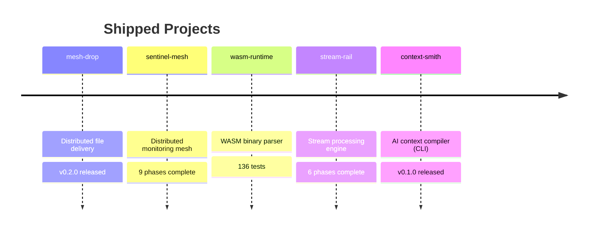

# flipslidersand — Forward Deployed Engineer

**Data Platform | Distributed Systems | Observability**

I build and experiment with data platforms, distributed systems, and AI-assisted infrastructure. My focus is turning ambiguous operational problems into working software, data pipelines, and observable systems.

---

## What I Do

- **Application & Data Engineering**: Go, Python, TypeScript, PostgreSQL, BigQuery
- **Distributed Systems**: Rust, Go, gRPC, WebAssembly, Kubernetes
- **Observability & Platform Engineering**: OpenTelemetry, Prometheus, Grafana, Argo CD, Docker
- **AI-Assisted Engineering**: Claude, Gemini, Vertex AI, RAG, embeddings, AI-assisted implementation and review workflows
- **R&D / Exploration**: PySpark, Delta Lake, eBPF, Terraform, Apache Airflow and related platform technologies

---

## Production Work

### Internal Business Platform — Platform / Application Engineering
Built an internal business system from requirements through production cutover in ~4 months, working across application, data, cloud infrastructure, deployment, and operations.

- Go / Python / React / TypeScript
- PostgreSQL / Cloud SQL
- GCP (Cloud Run, Cloud Functions, Cloud Storage, Vertex AI, Cloud Build)
- CI/CD, observability, incident-oriented tooling and operational improvements

**Impact**: estimated ¥8–15M cost avoidance compared with full external development  
**Velocity**: 1,431 commits across 22 repositories in 4 months, alongside meetings and internal support

---

## Open Source & R&D

### 🏗️ [marketplace-lakehouse-reference](https://github.com/flipslidersand/marketplace-lakehouse-reference)
**Medallion Architecture Data Platform**  
PySpark · Delta Lake · Streamlit · CI/CD

Reference implementation of a Bronze → Silver → Gold pipeline for multi-source e-commerce data, with incremental processing and data-quality validation.

### ⚙️ [fluxion](https://github.com/flipslidersand/fluxion)
**Distributed WebAssembly Job Scheduler**  
Rust · WebAssembly · MCP

R&D project exploring DAG scheduling, sandboxed execution, distributed workers, and workflow orchestration.

### 🧠 [context-smith](https://github.com/flipslidersand/context-smith)
**AI Context Compiler (CLI)**  
Rust · Tantivy · Tree-sitter · BM25 + vector search

Extracts task-relevant code from Git repositories into token-budgeted context bundles for LLMs. Offline-first, dependency-light, with ADR-documented design decisions.

### 🌊 [stream-rail](https://github.com/flipslidersand/stream-rail)
**Stream Processing Engine**  
Go · Tumbling Windows · BadgerDB · NATS

Real-time event aggregation over tumbling windows with watermarks, persistent state, and pluggable ingestion/notification — built to explore stream-processing internals.

### 🧩 [wasm-runtime](https://github.com/flipslidersand/wasm-runtime)
**WebAssembly Binary Parser**  
Rust · LEB128 · 136 tests

Decodes every known section (ids 0–12) of the WebAssembly MVP binary format into typed structs, with a `wasm-dump` CLI.

---

## 📋 Project Board

Shipped projects are tracked on a public board — every card links to a real repository with its Issue ↔ PR ↔ commit trail.

▶️ **[Portfolio Roadmap — GitHub Projects](https://github.com/users/flipslidersand/projects/11)**



---

## Tech Stack

```text
Production / frequent use:
  Go · Python · TypeScript · React · PostgreSQL
  GCP · Cloud Run · Cloud SQL · Cloud Build
  Docker · GitHub Actions · OpenTelemetry · Prometheus · Grafana
  Claude · Gemini · Vertex AI · RAG · Vector Search

R&D / project use:
  Rust · WebAssembly · Kubernetes · Argo CD
  PySpark · Delta Lake · BigQuery · Terraform · Apache Airflow · eBPF
```

---

## Featured Articles

- [AI-Native Development Flow: 4 Months, 153 PRs, Production](https://dev.to/flipslidersand/ai-native-development-flow-4-months-153-prs-production-10j3)
- [The AI Is Fast. The Decisions Are Mine.](https://dev.to/flipslidersand/the-ai-is-fast-the-decisions-are-mine-35p5)
- [People Who Resist Change Are Often Protecting Something](https://dev.to/flipslidersand/people-who-resist-change-are-often-protecting-something-1pgn)

---

## Let's Connect

- **GitHub**: [github.com/flipslidersand](https://github.com/flipslidersand)
- **Zenn**: [zenn.dev/flipslidersand](https://zenn.dev/flipslidersand)
- **Dev.to**: [dev.to/flipslidersand](https://dev.to/flipslidersand)
- **Email**: yukihanajob2025@gmail.com

Looking for Forward Deployed Engineer / Data Platform Engineer roles. Open to relocation; remote preferred.
